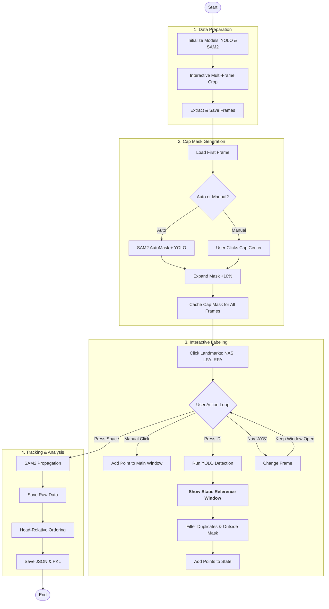
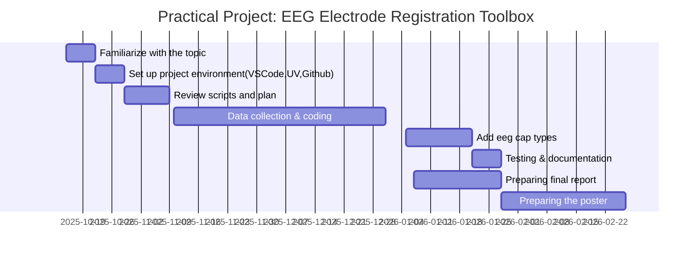

# Video EEG Electrode Registration Toolbox

## Overview
Electroencephalography (EEG) is a non-invasive technique that can measure the neural activity of the brain with high temporal resolution. EEG signals are recording from the scalp by placing several electrodes. Accurate localization of EEG electrodes is essential for reliable brain activity data analysis. Traditional digitizing methods such as ultrasound, motion capture and structured-light 3D scan are reliable methods but can require expensive equipment or complex setup procedures (Clausner et al., 2017;Homölle & Oostenveld, 2019;Reis et al., 2015;Shirazi et al., 2019;Taberna et all., 2019;).

## Why This Tool?

This Python-based toolbox offers a **user-friendly, easy-to-install solution** that simplifies EEG electrode registration using only a smartphone camera and computer vision. The method combines YOLOv11, a real-time object detection model, for electrode detection and Segment Anything 2 (SAM2), a foundation model for video segmentation and tracking, for robust electrode propagation across frames (Jocher et al., 2024; Ravi et al., 2024).

## Pipeline Overview
The technical logic follows a 4-stage pipeline: **Data Prep** $\rightarrow$ **Masking** $\rightarrow$ **Labeling** $\rightarrow$ **Tracking**


## Installation

### Prerequisites
- Python 3.12
- NVIDIA GPU with CUDA support is recommended for faster SAM2 tracking (CPU is supported but slower)

### Setup

1. Clone the repository:
```bash
git clone https://github.com/your-username/video-eeg-electrode-registration.git
cd video-eeg-electrode-registration
```
2. Create and sync the environment using `uv`:
```bash
uv venv
uv pip install -r requirements.txt
```

## User Guide (Interactive Pipeline v3)

### 1. Cropping (Head Selection)
**Goal:** Define the Region of Interest (ROI) to help the AI focus.

**Action:** A "Crop Preview" window will open.
* Use **A** (Back) and **S** (Forward) to scrub through the video.
* Draw **ONE box** that is large enough to contain the head in every frame (even when the participant turns).
* Press **SPACE** to confirm.

### 2. Cap Masking (Defining the Safe Zone)
**Goal:** Prevent the AI from detecting background noise (e.g., buttons on a shirt).

**Action:** A "Confirm Cap Mask" window appears with a yellow overlay.
* **Recommended:** Press **m** for Manual Mode, then click the **center** of the EEG cap.
* If the yellow mask covers the cap correctly, press **y** to accept.

### 3. Landmark Selection (Critical)
**Goal:** Define the head coordinate system.

**Action:** In the main "Pipeline" window, click these 3 points in exact order:
1. **Nose** (Nasion)
2. **Left Ear** (LPA)
3. **Right Ear** (RPA)

### 4. Electrode Detection (The "Reference Map" Strategy)
**Goal:** Label all electrodes exactly once without creating duplicates.

**Step A: The Main Sweep**
1. Move to a frame (using **A** / **S**) where the **most** electrodes are visible (usually the front/top view).
2. Press **D** to run YOLO Auto-Detection. (Do this only **ONCE**).
3. **A new "Reference Map" window will pop up.**
   * This window is a **static screenshot** of your detections. It will **not move**.
   * Use this window as a "cheat sheet" to remember which electrodes are already caught (marked in yellow boxes).

**Step B: Manual Fill**
1. Look at the **Main "Pipeline" Window**.
2. Use **A** / **S** to rotate the head to side/back views.
3. Compare with your **Reference Map**:
   * If you see an electrode in the Main Window that is **NOT** marked in the Reference Map, **Click it** to add it manually.
   * **Warning:** Do NOT re-click electrodes that are already marked in the Reference Map, even if they moved. The tracker already knows where they are.

### 5. Finish & Track
* Once all unique electrodes have been identified (either by YOLO or your clicks), press **SPACE**.
* The script will close the GUI and run the SAM2 tracker.
* Wait for the progress bar to reach 100%.

## Outputs

The results are saved in the `results/` folder:

| File | Format | Description |
| :--- | :--- | :--- |
| **`tracking_results.pkl`** | Pickle | **Raw tracking data.** Contains the exact (X, Y) pixel coordinates for every electrode in every frame. (No smoothing applied). |
| `electrode_order.json` | JSON | A sorted list of electrode IDs ordered spatially (Front-to-Back, Left-to-Right). |
| `crop_info.json` | JSON | Metadata about the crop coordinates (`x, y, w, h`) used for this session. Needed for 3D reconstruction. |

## References

1.  **Clausner, T., Dalal, S. S., & Crespo-García, M. (2017).** Photogrammetry-Based Head Digitization for Rapid and Accurate Localization of EEG Electrodes and MEG Fiducial Markers Using a Single Digital SLR Camera. *Frontiers in Neuroscience*, 11, 264.
2.  **Homölle, S., & Oostenveld, R. (2019).** Using a structured-light 3D scanner to improve EEG source modeling with more accurate electrode positions. *Journal of Neuroscience Methods*, 326, 108378.
3.  **Jocher, G., et al. (2024).** Ultralytics YOLO. Available at: https://github.com/ultralytics/ultralytics.
4.  **Ravi, N., et al. (2024).** SAM 2: Segment Anything in Images and Videos. Available at: https://github.com/facebookresearch/sam2.
5.  **Reis, P. M. R., & Lochmann, M. (2015).** Using a motion capture system for spatial localization of EEG electrodes. *Frontiers in Neuroscience*, 9, 130.
6.  **Shirazi, S. Y., & Huang, H. J. (2019).** More Reliable EEG Electrode Digitizing Methods Can Reduce Source Estimation Uncertainty, but Current Methods Already Accurately Identify Brodmann Areas. *Frontiers in Neuroscience*, 13, 1159.
7.  **Taberna, G. A., Marino, M., Ganzetti, M., & Mantini, D. (2019).** Spatial localization of EEG electrodes using 3D scanning. *Journal of Neural Engineering*, 16, 026020.

## Project Timeline



