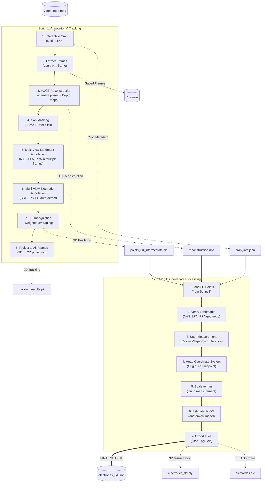

# Video EEG Electrode Registration Pipeline

## Overview
Electroencephalography (EEG) is a non-invasive technique that can measure the neural activity of the brain with high temporal resolution. EEG signals are recording from the scalp by placing several electrodes. Accurate localization of EEG electrodes is essential for reliable brain activity data analysis. Traditional digitizing methods such as ultrasound, motion capture and structured-light 3D scan are reliable methods but can require expensive equipment or complex setup procedures (Clausner et al., 2017;Homölle & Oostenveld, 2019;Reis et al., 2015;Shirazi et al., 2019;Taberna et all., 2019;).

## Why This Pipeline?

The goal of this pipeline is to reduce cost, setup complexity, and participant burden while maintaining reasonable spatial accuracy.

Key design principles:

- No dedicated digitization hardware required  
- Minimal manual interaction  
- Subject-specific head geometry (no template head models)  
- Reproducible and modular processing steps  

## Pipeline Architecture

The pipeline consists of **two** main scripts**:

| Script | Purpose | Key Operations |
|--------|---------|----------------|
| **Script 1** | Annotation & Tracking | VGGT reconstruction → Multi-view annotation → 3D triangulation → Projection |
| **Script 2** | 3D Coordinate Processing | Load 3D points → Head coordinate system → Scale to mm → Export |


## Pipeline Workflow



---
## Installation

### Prerequisites
- Python 3.12+
- NVIDIA GPU with CUDA support (Recommended for fast processing)
- [uv](https://github.com/astral-sh/uv) (Fast Python package installer)

### Setup

1. Clone the repository:
```bash
git clone [https://github.com/your-username/video-eeg-electrode-registration.git](https://github.com/your-username/video-eeg-electrode-registration.git)
cd video-eeg-electrode-registration
```
2. Create and sync the environment using `uv`:

```bash
uv venv
# Linux/macOS: source .venv/bin/activate
# Windows: .venv\Scripts\activate

uv pip install -r requirements.txt
```

## User Guide

This pipeline is divided into three steps. You must run them in order.

### **Step 1: Annotation & Tracking**

**Command:** `python scripts/script1.py`

#### 1.1 Video Selection & Cropping
* A list of available videos will appear. Enter the number to select.
* **Crop Preview** window opens:
    * Use `A` (Back) and `S` (Forward) to navigate frames
    * **Draw a box** large enough to contain the head in ALL frames
    * Press `SPACE` to confirm

#### 1.2 VGGT 3D Reconstruction
* Runs automatically after cropping
* **First run:** Downloads VGGT model weights (~4GB)
* **Runtime:** ~1-3 minutes on GPU
* Shows GPU memory usage and progress

> **If VGGT crashes (out of memory):**
> - Close other GPU applications (Chrome, VS Code, etc.)
> - Reduce `MAX_VGGT_FRAMES` in script1.py (default: 35)

#### 1.3 Cap Masking
* Click the **center** of the EEG cap
* Yellow overlay should cover the cap
* Press `Y` to accept, `R` to redo

#### 1.4 Landmark Annotation (Multi-View)
* For each landmark (NAS, LPA, RPA):
    * Navigate to frames where it's **clearly visible**
    * **Click directly on the landmark** in multiple frames
    * Press `Y` when done with that landmark

> **Tip:** More observations = better accuracy. Click each landmark in 3-5 different frames/views.

> **IMPORTANT:** Use **DIFFERENT colored stickers** for each landmark!
> - NAS: **Red** sticker
> - LPA: **Blue** sticker  
> - RPA: **Green** sticker

#### 1.5 Electrode Annotation (Multi-View)
* Navigate through frames using `A`/`D` keys
* **Click** on electrodes to add them
* Press `SPACE` for YOLO auto-detection
* Click near existing electrode (projected) to add observation
* Press `Q` when all electrodes are marked

> **Strategy:** 
> 1. Go to  BACK SIDE view → Auto-detect with SPACE
> 2. Go to LEFT view → Click any new electrodes
> 3. Go to RIGHT view → Click any new electrodes
> 4. Go to BACK view → Click any new electrodes

#### 1.6 Review & Accept
* Review the projected tracking across all frames
* Use `P` to play/pause
* Press `SPACE` to accept, `R` to redo

---

### **Step 2: 3D Coordinate Processing**

**Command:** `python scripts/script2.py`

#### 2.1 Automatic Processing
* Loads 3D positions from Script 1
* Validates landmark geometry
* Shows landmark positions and distances

#### 2.2 Head Measurement Input
The script pauses to ask for a measurement to scale the model:

| Option | Description | How to Measure |
|--------|-------------|----------------|
| **1. Caliper** | Direct ear-to-ear distance | Measure straight line between left and right ear tragus |
| **2. Tape Arc** | Arc over top of head | Measure from left ear → top of head → right ear |
| **3. Circumference** | Head circumference | Measure around the head above the eyebrows |
| **4. Default** | Use 150mm | Skip measurement (less accurate) |

#### 2.3 Output Generation
* Transforms to head coordinate system
* Estimates INION using anatomical model
* Exports `.json`, `.ply`, and `.elc` files

---

## Outputs

Results are saved in the `results/` folder:

| File | Description |
|:-----|:------------|
| **`electrodes_3d.json`** | **FINAL OUTPUT.** 3D coordinates in mm with uncertainty estimates |
| `electrodes_3d.ply` | 3D point cloud for visualization (MeshLab, CloudCompare, Blender) |
| `electrodes.elc` | EEG software compatible format |
| `tracking_results.pkl` | 2D tracking data (frame-by-frame pixel coordinates) |
| `points_3d_intermediate.pkl` | Raw 3D positions before coordinate transform |
| `crop_info.json` | Crop region metadata |
| `vggt_output/reconstruction.npz` | VGGT depth maps and camera parameters |

### Output Coordinate System

```
        Z (up)
        ↑
        |
        |      Y (front/NAS)
        |     ↗
        |   ↗
        | ↗
        +------------→ X (right/RPA)
       /
      /
     ↙ (left/LPA)

Origin: Midpoint between LPA and RPA (ears)
X-axis: LPA → RPA (left to right)
Y-axis: INION → NAS (back to front)
Z-axis: Down → Up (perpendicular)
Units:  Millimeters (mm)
```

### JSON Output Format

```json
{
  "coordinate_system": {
    "origin": "midpoint between LPA and RPA",
    "x_axis": "left to right (LPA -> RPA)",
    "y_axis": "back to front (INION -> NAS)",
    "z_axis": "down to up"
  },
  "units": "mm",
  "landmarks": {
    "NAS": {"position": [0.0, 85.2, 12.3], "uncertainty": [1.2, 1.5, 2.1]},
    "LPA": {"position": [-75.0, 0.0, 0.0], "uncertainty": [1.1, 1.3, 1.8]},
    "RPA": {"position": [75.0, 0.0, 0.0], "uncertainty": [1.0, 1.2, 1.7]},
    "INION": {"position": [0.0, -89.5, -8.2]}
  },
  "electrodes": {
    "E0": {"position": [12.3, 45.6, 78.9], "uncertainty": [2.1, 2.3, 2.5]},
    "E1": {"position": [-15.2, 42.1, 76.5], "uncertainty": [1.8, 2.0, 2.2]}
  },
  "num_electrodes": 24
}
```

---

## Troubleshooting

### Common Issues

| Problem | Cause | Solution |
|---------|-------|----------|
| VGGT crashes / out of memory | Not enough GPU VRAM | Reduce `MAX_VGGT_FRAMES` to 25 or close other apps |
| LPA-RPA distance very small | Same colored stickers | Use DIFFERENT colored stickers for NAS/LPA/RPA |
| "Missing landmarks: NAS/LPA/RPA" | Landmark not annotated | Re-run Script 1, click landmarks in multiple frames |
| Poor accuracy (>15mm error) | Too few observations | Add more landmark/electrode clicks in different views |
| Electrodes not appearing in all frames | Depth occlusion | Normal - electrodes only show when visible |
## References

1. **Clausner, T., Dalal, S. S., & Crespo-García, M. (2017).** Photogrammetry-Based Head Digitization for Rapid and Accurate Localization of EEG Electrodes and MEG Fiducial Markers Using a Single Digital SLR Camera. *Frontiers in Neuroscience*, 11, 264.
2. **Homölle, S., & Oostenveld, R. (2019).** Using a structured-light 3D scanner to improve EEG source modeling with more accurate electrode positions. *Journal of Neuroscience Methods*, 326, 108378.
3. **Jocher, G., et al. (2024).** Ultralytics YOLO. Available at: https://github.com/ultralytics/ultralytics.
4. **Ravi, N., et al. (2024).** SAM 2: Segment Anything in Images and Videos. Available at: https://github.com/facebookresearch/sam2.
5. **Reis, P. M. R., & Lochmann, M. (2015).** Using a motion capture system for spatial localization of EEG electrodes. *Frontiers in Neuroscience*, 9, 130.
6. **Shirazi, S. Y., & Huang, H. J. (2019).** More Reliable EEG Electrode Digitizing Methods Can Reduce Source Estimation Uncertainty, but Current Methods Already Accurately Identify Brodmann Areas. *Frontiers in Neuroscience*, 13, 1159.
7. **Taberna, G. A., Marino, M., Ganzetti, M., & Mantini, D. (2019).** Spatial localization of EEG electrodes using 3D scanning. *Journal of Neural Engineering*, 16, 026020.
8. **Wang, J., et al. (2025).** VGGT: Visual Geometry Grounded Transformer. Available at: https://github.com/facebookresearch/vggt.


## Project Timeline


