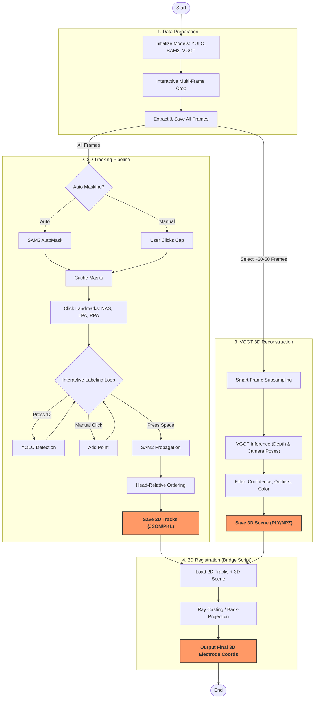
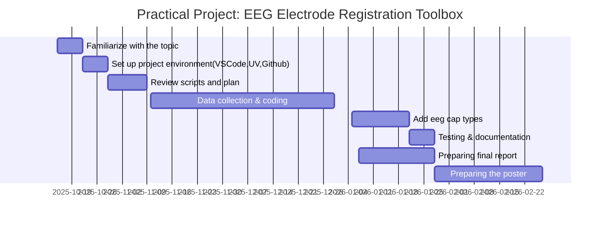

# Video EEG Electrode Registration Toolbox

## Overview
Electroencephalography (EEG) is a non-invasive technique that can measure the neural activity of the brain with high temporal resolution. EEG signals are recording from the scalp by placing several electrodes. Accurate localization of EEG electrodes is essential for reliable brain activity data analysis. Traditional digitizing methods such as ultrasound, motion capture and structured-light 3D scan are reliable methods but can require expensive equipment or complex setup procedures (Clausner et al., 2017;Homölle & Oostenveld, 2019;Reis et al., 2015;Shirazi et al., 2019;Taberna et all., 2019;).

## Why This Tool?

This Python-based toolbox offers a **user-friendly, easy-to-install solution** that simplifies EEG electrode registration using only a smartphone camera and computer vision. The method combines YOLOv11, a real-time object detection model, for electrode detection and Segment Anything 2 (SAM2), a foundation model for video segmentation and tracking, for robust electrode propagation across frames (Jocher et al., 2024; Ravi et al., 2024).

## Pipeline Overview
The technical logic follows a 3-stage pipeline: **Data Prep** $\rightarrow$ **2D Tracking & 3D Reconstruction** $\rightarrow$ **3D Registration** 



## Installation

### Prerequisites
- Python 3.12
- **NVIDIA GPU** with CUDA support is highly recommended.
  - *Note:* The 2D pipeline (SAM2) and 3D pipeline (VGGT) work on CPU, but 3D reconstruction will be significantly slower.

### Setup

1. Clone the repository:
```bash
git clone https://github.com/your-username/video-eeg-electrode-registration.git
cd video-eeg-electrode-registration
```
2. Clone the VGGT submodule (Required for 3D reconstruction):
```bash
# Clone VGGT into the project root
git clone [https://github.com/facebookresearch/vggt.git](https://github.com/facebookresearch/vggt.git)
```
3.Create and sync the environment using `uv`:
```bash
uv venv
# Install standard dependencies
uv pip install -r requirements.txt

# Install 3D visualization and analysis tools
uv pip install viser scikit-learn
```

## User Guide 

The pipeline is split into two parallel phases that merge at the end.

---

## Phase 1: 2D Tracking (Coordinate Extraction)

### Run the tracking script
```bash
uv run python scripts/Script1_yolo_SAM2.py
```

### 1. Cropping (Head Selection)
**Goal:** Define the Region of Interest (ROI) to help the AI focus.

**Action:** A "Crop Preview" window will open.
* Use **A** (Back) and **S** (Forward) to scrub through the video.
* Draw **ONE box** that is large enough to contain the head in every frame (including head turns).
* Press **SPACE** to confirm.

### 2. Cap Masking (Defining the Safe Zone)
**Goal:**
Prevent the AI from detecting background objects (buttons, walls, etc.).
**Action:**
Click the center of the EEG cap.
If the yellow mask correctly covers the cap, press `y` to accept.

### 3. Landmark Selection (Critical)
**Goal:** Define the head coordinate system.
**Action:**
Click the following three landmarks **in exact order**:
1) Nasion (NAS)
2) Left Preauricular Point (LPA)
3) Right Preauricular Point (RPA)

### 4. Electrode Detection (The "Reference Map" Strategy)
**Goal:** Label all electrodes exactly once without creating duplicates.

**Step A: Automatic Detection**
- Navigate to a frame where many electrodes are visible.
- Press `D` to run YOLO detection.
- A static Reference Map window will appear.
- Use this as a cheat sheet to see which electrodes are already registered.
**Step B: Manual Completion**
-Use A / S to rotate through side views.
-If you see an electrode in the main window not shown in the Reference Map, click it to add it.
! Important:
Do not **re**-click electrodes that already appear in the Reference Map.

### 5. Track & Save
- Press SPACE to finish labeling.
- Wait for the progress bar to reach 100%.
- The system will automatically track all electrodes across the video and save the results.

## Phase 2: 3D Reconstruction (VGGT)

Run the reconstruction script
```bash
uv run python scripts/Script2_vggt.py

```
### Interactive Visualization
Once processing is complete, a 3D viewer opens at:

```bash
http://localhost:8080

```
## Outputs

Results are saved in the `results/` directory:

| File | Type | Description |
|------|------|-------------|
| `tracking_results.pkl` | 2D Data | Raw electrode tracking data (X, Y) for every electrode in every frame. |
| `electrode_order.json` | Metadata | Spatially ordered electrode IDs (front-to-back). |
| `crop_info.json` | Metadata | Crop coordinates (`x`, `y`, `w`, `h`) used to align 2D and 3D data. |
| `head_reconstruction.ply` | 3D Model | Point cloud of the reconstructed head (viewable in MeshLab or other 3D software). |
| `head_reconstruction.npz` | 3D Data | Scene data containing points, colors, and camera poses. |


## References

1.  **Clausner, T., Dalal, S. S., & Crespo-García, M. (2017).** Photogrammetry-Based Head Digitization for Rapid and Accurate Localization of EEG Electrodes and MEG Fiducial Markers Using a Single Digital SLR Camera. *Frontiers in Neuroscience*, 11, 264.
2.  **Homölle, S., & Oostenveld, R. (2019).** Using a structured-light 3D scanner to improve EEG source modeling with more accurate electrode positions. *Journal of Neuroscience Methods*, 326, 108378.
3.  **Jocher, G., et al. (2024).** Ultralytics YOLO. Available at: https://github.com/ultralytics/ultralytics.
4.  **Ravi, N., et al. (2024).** SAM 2: Segment Anything in Images and Videos. Available at: https://github.com/facebookresearch/sam2.
5.  **Reis, P. M. R., & Lochmann, M. (2015).** Using a motion capture system for spatial localization of EEG electrodes. *Frontiers in Neuroscience*, 9, 130.
6.  **Shirazi, S. Y., & Huang, H. J. (2019).** More Reliable EEG Electrode Digitizing Methods Can Reduce Source Estimation Uncertainty, but Current Methods Already Accurately Identify Brodmann Areas. *Frontiers in Neuroscience*, 13, 1159.
7.  **Taberna, G. A., Marino, M., Ganzetti, M., & Mantini, D. (2019).** Spatial localization of EEG electrodes using 3D scanning. *Journal of Neural Engineering*, 16, 026020.

## Project Timeline



