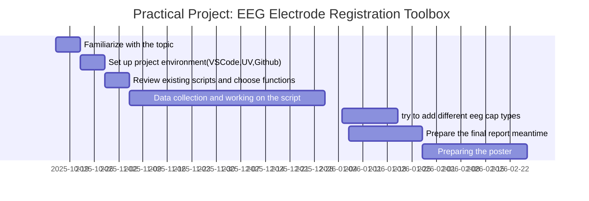

# video-eeg-electrode-registration
Python toolbox for video based EEG electrode registration using Segment Anything
## Project Timeline

```mermaid
gantt
    title Practical Project: EEG Electrode Registration Toolbox
    dateFormat YYYY-MM-DD
    Familiarize with the topic: 2025-10-15,2025-10-22
    Set up project environment(VSCode,UV,Github):2025-10-22,2025-10-29
    Review existing scripts and choose functions:2025-10-29,2025-11-05
    Data collection and working on the script:2025-11-05,2025-12-31
    try to add different eeg cap types:2026-01-05,2026-01-21
    Prepare the final report meantime:2026-01-07,2026-01-28
    Preparing the poster:2026-01-28,2026-02-27

```
