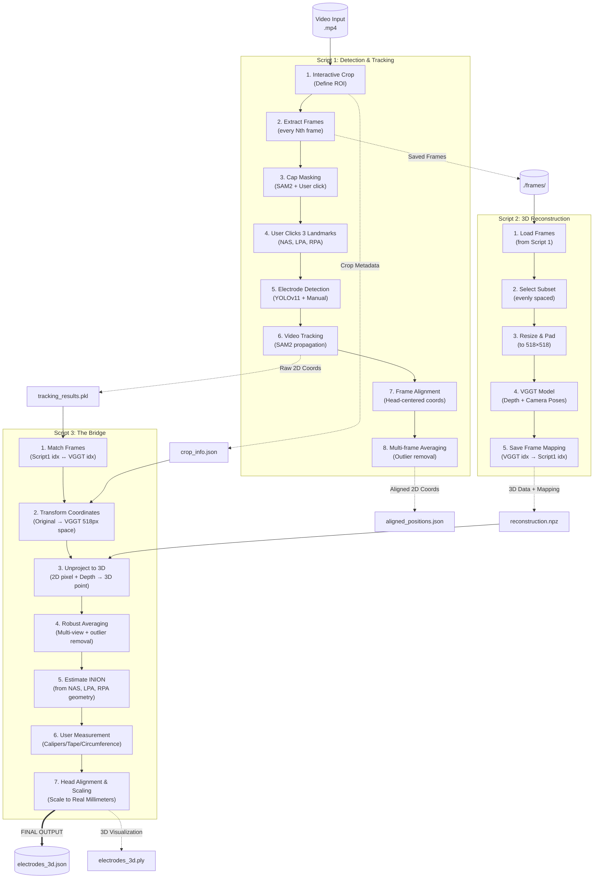
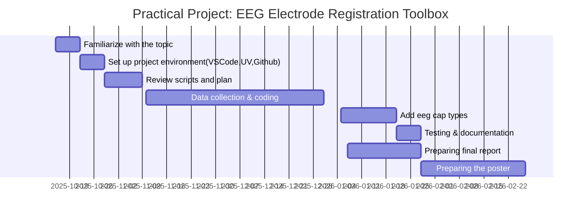

# Video EEG Electrode Registration Pipeline

## Overview
Electroencephalography (EEG) is a non-invasive technique that can measure the neural activity of the brain with high temporal resolution. EEG signals are recording from the scalp by placing several electrodes. Accurate localization of EEG electrodes is essential for reliable brain activity data analysis. Traditional digitizing methods such as ultrasound, motion capture and structured-light 3D scan are reliable methods but can require expensive equipment or complex setup procedures (Clausner et al., 2017;Homölle & Oostenveld, 2019;Reis et al., 2015;Shirazi et al., 2019;Taberna et all., 2019;).

## Why This Pipeline?

The goal of this pipeline is to reduce cost, setup complexity, and participant burden while maintaining reasonable spatial accuracy.

Key design principles:

- No dedicated digitization hardware required  
- Minimal manual interaction  
- Subject-specific head geometry (no template head models)  
- Reproducible and modular processing steps  

The pipeline consists of **three main computational stages**:

1. **2D Electrode Detection and Tracking (Script 1)**  
   EEG electrodes are detected and tracked across video frames using YOLO and SAM2, producing stable 2D electrode trajectories. A head-centered 2D coordinate system is defined using anatomical landmarks.

2. **3D Head Reconstruction (Script 2)**  
   A subject-specific 3D head surface is reconstructed from the same video using VGGT, including depth estimation and camera pose recovery.

3. **2D-to-3D Projection and Head Coordinate Alignment (Script 3)**  
   The tracked 2D electrode positions are projected onto the reconstructed 3D head surface, snapped to the scalp, and transformed into a standardized head coordinate system with metric units (mm).

## Pipeline Workflow

The pipeline is organized into three sequential scripts that transform a short video
into head-aligned 3D EEG electrode coordinates.


## Installation

### Prerequisites
- Python 3.12+
- NVIDIA GPU with CUDA support (Recommended for fast processing)
- [uv](https://github.com/astral-sh/uv) (Fast Python package installer)

### Setup

1. Clone the repository:
```bash
git clone [https://github.com/your-username/video-eeg-electrode-registration.git](https://github.com/your-username/video-eeg-electrode-registration.git)
cd video-eeg-electrode-registration
```
2. Create and sync the environment using `uv`:

```bash
uv venv
# Linux/macOS: source .venv/bin/activate
# Windows: .venv\Scripts\activate

uv pip install -r requirements.txt
```

## User Guide

This pipeline is divided into three steps. You must run them in order.

### **Step 1: Detection & Tracking**
**Command:** `python scripts/pipeline_step1_tracking.py`

#### **1. Cropping (Head Selection)**
* **Goal:** Define the Region of Interest (ROI) to help the AI focus.
* **Action:** A "Crop Preview" window will open.
    * Use `A` (Back) and `S` (Forward) to scrub through the video.
    * **Draw ONE box** that is large enough to contain the head in **every** frame (even when the participant turns).
    * Press `SPACE` to confirm.

#### **2. Cap Masking (Defining the Safe Zone)**
* **Goal:** Prevent the AI from detecting background noise (e.g., buttons on a shirt).
* **Action:** A "Confirm Cap Mask" window appears with a yellow overlay.
    * **Recommended:** Press `m` for Manual Mode, then click the **center** of the EEG cap.
    * If the yellow mask covers the cap correctly, press `y` to accept.

#### **3. Landmark Selection (Critical)**
* **Goal:** Define the head coordinate system for alignment.
* **Action:** In the main "Pipeline" window, click these **3 points** in exact order:
    1.  **NAS (Nasion)** - Bridge of nose, between eyebrows
    2.  **LPA (Left Pre-Auricular)** - Left ear tragus point
    3.  **RPA (Right Pre-Auricular)** - Right ear tragus point

> **Note:** INION (back of head) is estimated automatically using the geometric relationship with the other landmarks.

#### **4. Electrode Detection (The "Sweep & Fill" Strategy)**
* **Goal:** Label all electrodes exactly once.
* **Step A (Main Sweep):** Move to a frame (using `A`/`S`) where the most electrodes are visible (usually the front view). Press `D` to run YOLO Auto-Detection. (Do this only ONCE).
* **Step B (Manual Fill):** Move to side/back views where hidden electrodes appear. Manually **Click** on any new electrodes that were not detected in Step A.
* *Warning: Do NOT re-click electrodes that already have a dot. The tracker knows where they are.*

#### **5. Finish & Track**
* Once all electrodes have a unique ID/dot, press `SPACE`.
* The script will close the GUI and run the SAM2 tracker. Wait for the progress bar to reach 100%.

---

### **Step 2: 3D Reconstruction (VGGT)**
**Command:** `python scripts/pipeline_step2_reconstruction.py`

* **Goal:** Build the 3D geometry of the head using the frames extracted in Step 1.
* **Action:** The script runs automatically.
    * *First run:* It will download the VGGT model weights (4GB).
    * *Runtime:* ~2 minutes on GPU, ~1-2 hours on CPU.
    * *Visualization:* At the end, a 3D viewer will open showing the point cloud. Close it to finish.

---

### **Step 3: The Bridge (Fusion)**
**Command:** `python scripts/run_bridge.py`

* **Goal:** Combine 2D tracking data with 3D depth and scale to real-world millimeters.
* **Action:** The script will pause and ask for a **Head Measurement** to scale the model correctly. You will see these 4 options:

    1.  **Direct Ear-to-Ear (Caliper):** Measure the straight-line distance between the tragus of each ear.
    2.  **Tape Over Head (Arc):** Measure from Left Ear $\to$ Top of Head $\to$ Right Ear. (The script automatically converts this arc to a straight line).
    3.  **Head Circumference:** Measure the circle around the head just above the eyebrows.
    4.  **Skip (Default):** Use a standard adult average (150mm).

* **Input:** Type the number of your choice (e.g., `2`) and then the value in millimeters (e.g., `360`).
* **Result:** `electrodes_3d.json` (Real-world mm coordinates).

---

## Outputs

The results are saved in the `results/` folder:

| File | Description |
| :--- | :--- |
| **`electrodes_3d.json`** | **FINAL OUTPUT.** The 3D (X, Y, Z) coordinates of all electrodes in millimeters, aligned to the head center. |
| `electrodes_3d.ply` | A 3D file of the electrodes you can open in MeshLab or Blender to visualize the positions. |
| `tracking_results.pkl` | Raw 2D tracking data from Step 1 (Frame-by-frame pixel coordinates). |
| `aligned_positions.json` | Averaged 2D positions from Step 1 (Useful for 2D topology plots). |
| `reconstruction.npz` | The dense 3D point cloud and camera parameters generated by VGGT. |

## References

1.  **Clausner, T., Dalal, S. S., & Crespo-García, M. (2017).** Photogrammetry-Based Head Digitization for Rapid and Accurate Localization of EEG Electrodes and MEG Fiducial Markers Using a Single Digital SLR Camera. *Frontiers in Neuroscience*, 11, 264.
2.  **Homölle, S., & Oostenveld, R. (2019).** Using a structured-light 3D scanner to improve EEG source modeling with more accurate electrode positions. *Journal of Neuroscience Methods*, 326, 108378.
3.  **Jocher, G., et al. (2024).** Ultralytics YOLO. Available at: https://github.com/ultralytics/ultralytics.
4.  **Ravi, N., et al. (2024).** SAM 2: Segment Anything in Images and Videos. Available at: https://github.com/facebookresearch/sam2.
5.  **Reis, P. M. R., & Lochmann, M. (2015).** Using a motion capture system for spatial localization of EEG electrodes. *Frontiers in Neuroscience*, 9, 130.
6.  **Shirazi, S. Y., & Huang, H. J. (2019).** More Reliable EEG Electrode Digitizing Methods Can Reduce Source Estimation Uncertainty, but Current Methods Already Accurately Identify Brodmann Areas. *Frontiers in Neuroscience*, 13, 1159.
7.  **Taberna, G. A., Marino, M., Ganzetti, M., & Mantini, D. (2019).** Spatial localization of EEG electrodes using 3D scanning. *Journal of Neural Engineering*, 16, 026020.

## Project Timeline



