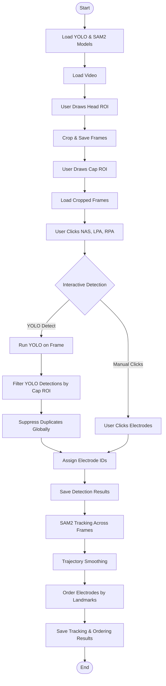

# video-eeg-electrode-registration
Electroencephalography (EEG) is a non-invasive technique that can measure the neural activity of the brain with high temporal resolution. EEG signals are recording from the scalp by placing several electrodes. Accurate localization of EEG electrodes is essential for reliable brain activity data analysis. Traditional digitizing methods such as ultrasound, motion capture and structured-light 3D scan are reliable methods but can require expensive equipment or complex setup procedures (Shirazi et al., 2019;Taberna et all., 2019;Reis et al., 2015).
Aim of this project is to create a more accessible alternative by developing video-based electrode registration toolbox by using Segment Anything (SAM2). This Python toolbox will automatically detect EEG electrode locations and verify if they are correctly placed according to chosen EEG cap type.
The expected outcome is user-friendly and easy to install Python toolbox that makes EEG electrode registration simpler.

## Project Timeline

## Pipeline Flowchart

