# Video EEG Electrode Registration Pipeline

## Overview
Electroencephalography (EEG) is a non-invasive technique that can measure the neural activity of the brain with high temporal resolution. EEG signals are recording from the scalp by placing several electrodes. Accurate localization of EEG electrodes is essential for reliable brain activity data analysis. Traditional digitizing methods such as ultrasound, motion capture and structured-light 3D scan are reliable methods but can require expensive equipment or complex setup procedures (Clausner et al., 2017;Homölle & Oostenveld, 2019;Reis et al., 2015;Shirazi et al., 2019;Taberna et all., 2019;).

## Why This Pipeline?

The goal of this pipeline is to reduce cost, setup complexity, and participant burden while maintaining reasonable spatial accuracy.

Key design principles:

- No dedicated digitization hardware required  
- Minimal manual interaction  
- Subject-specific head geometry (no template head models)  
- Reproducible and modular processing steps  

---

## Pipeline Architecture

The pipeline consists of **two main scripts**:

| Script | Purpose | Key Operations |
|--------|---------|----------------|
| **Script 1** | Annotation & Tracking | Crop → Extract frames → VGGT reconstruction → Sequential landmark annotation (NAS→LPA→RPA) → Electrode annotation → 3D triangulation → Save |
| **Script 2** | 3D Coordinate Processing | Load 3D points → Uncertainty classification → User measurement → Coordinate transform → Scale to mm → Export |

---

## Pipeline Workflow

```mermaid
flowchart TD
    Video[("Video Input\nIMG_3841.mp4")]

    subgraph Script1 ["Script 1: Annotation & Tracking"]
        direction TB
        Select["1. Select Video"]
        Crop["2. Interactive Crop<br\>(Define head ROI)"]
        Extract["3. Extract Frames<br\>(every Nth frame)"]
        VGGT["4. VGGT Reconstruction<br\>(Camera poses + Depth maps)"]
        NAS["5a. Annotate NAS<br\>(Window 1: 3-5 clicks)"]
        LPA["5b. Annotate LPA<br\>(Window 2: 3-5 clicks)"]
        RPA["5c. Annotate RPA<br\>(Window 3: 3-5 clicks)"]
        Electrodes["6. Annotate Electrodes<br\>(Window 4: Manual + YOLO)"]
        Triangulate["7. 3D Triangulation<br\>(Multi-view → 3D positions)"]
        Quality["8. Quality Filtering<br\>(YOLO 80% confidence)"]
        Project["9. Project & Track<br\>(3D → 2D all frames)"]
        
        Select --> Crop
        Crop --> Extract
        Extract --> VGGT
        VGGT --> Landmarks
        Landmarks --> Electrodes
        Electrodes --> Triangulate
        Triangulate --> Quality
        Quality --> Project
    end

    Video --> Select
    Project -.->|"Video-specific folder"| ResultsFolder[("results/IMG_3841/")]
    ResultsFolder -.-> TrackPkl["tracking_results.pkl"]
    ResultsFolder -.-> Points3D["points_3d_intermediate.pkl"]
    ResultsFolder -.-> Visibility["visibility_stats.pkl"]
    ResultsFolder -.-> VGGTDir["vggt_output/"]

    subgraph Script2 ["Script 2: 3D Coordinate Processing"]
        direction TB
        SelectRes["1. Select Results Folder"]
        Load3D["2. Load 3D Points"]
        Verify["3. Verify Landmarks"]
        Uncertainty["4. Classify Uncertainty"]
        Measure["5. User Measurement"]
        HeadCoord["6. Head Coordinate System"]
        Scale["7. Scale to mm"]
        EstInion["8. Estimate INION"]
        Export["9. Export Files"]
        
        SelectRes --> Load3D
        Load3D --> Verify
        Verify --> Uncertainty
        Uncertainty --> Measure
        Measure --> HeadCoord
        HeadCoord --> Scale
        Scale --> EstInion
        EstInion --> Export
    end

    ResultsFolder --> SelectRes
    
    Export ==>|"FINAL OUTPUT"| FinalFolder[("results/IMG_3841/")]
    FinalFolder ==> FinalJson["electrodes_3d.json"]
    FinalFolder -.-> FinalPly["electrodes_3d.ply"]
    FinalFolder -.-> FinalElc["electrodes.elc"]
    
    style FinalJson fill:#90EE90
```



---

## Installation

### Prerequisites
- Python 3.12+
- NVIDIA GPU with CUDA support (Recommended for fast processing)
- [uv](https://github.com/astral-sh/uv) (Fast Python package installer)


## User Guide

### Recording Tips (Before You Start)

**For best results:**

1. **Use different colored stickers for landmarks:**
   - NAS (Nasion): RED sticker
   - LPA (Left ear): BLUE sticker  
   - RPA (Right ear): GREEN sticker

2. **Video recording:**
   - Walk slowly around the subject's head (360° coverage)
   - Record for 30-60 seconds
   - Good lighting (avoid shadows)
   - Keep camera 50-100cm from head

3. **File organization:**
   - Place videos in `data/Video_Recordings/`
   - Use descriptive names (e.g., `Subject1_Baseline.mp4`)

---

### **Step 1: Annotation & Tracking**

**Command:** `python scripts/script1.py`

#### 1.1 Video Selection
- Lists available videos from `data/Video_Recordings/`
- Creates video-specific results folder (e.g., `results/IMG_3841/`)
- All outputs for this video stored separately

---

#### 1.2 Interactive Cropping
**Goal:** Define region containing the head in ALL frames

**Controls:**
- `A` / `D` - Navigate backward/forward through frames
- Mouse - Draw bounding box around head
- `SPACE` - Confirm and continue

**Tips:**
- Make box **large enough** to contain head in all frames
- Try to keep as much as background information for VGGT reconstruction

---

#### 1.3 VGGT 3D Reconstruction
**Automatic step** - runs after cropping

**Timing:**
- GPU (NVIDIA): 1-3 minutes
- CPU: 20-30 minutes

> **If VGGT crashes (out of memory):**
> - Close other GPU applications
> - Edit `script1.py` line ~160: `MAX_VGGT_FRAMES = 25`

---

#### 1.4 Landmark Annotation (Sequential Windows)

**The script opens 3 separate windows, one for each landmark:**

**Window 1: NAS (Nasion)**
1. Window opens showing "Annotate NAS"
2. Navigate frames with `A` / `D` to find clear views of NAS
3. Click on the NAS landmark (red sticker) in 3-5 different frames
4. Press `Y` to accept
5. Window closes → LPA window opens

**Window 2: LPA (Left Ear)**
1. Window opens showing "Annotate LPA"
2. Navigate to frames where LPA is visible
3. Click on LPA (blue sticker) in 3-5 different frames
4. Press `Y` to accept
5. Window closes → RPA window opens

**Window 3: RPA (Right Ear)**
1. Window opens showing "Annotate RPA"
2. Navigate to frames where RPA is visible
3. Click on RPA (green sticker) in 3-5 different frames
4. Press `Y` to accept
5. Window closes → Electrode annotation window opens

**Controls (same for all landmark windows):**
- `A` / `D` - Navigate frames
- `Left Click` - Add observation for current landmark
- `Y` - Accept and move to next landmark

**Tips:**
- Click each landmark in **3-5 different frames** from different viewing angles
- More observations = better 3D triangulation accuracy
- Use **different colored stickers** for easier identification

**CRITICAL:** Use **different colored stickers** for each landmark!
- NAS: RED sticker
- 🔵 LPA: BLUE sticker
- 🟢 RPA: GREEN sticker

---

#### 1.5 Electrode Annotation Window

**After RPA window closes, the electrode annotation window opens.**

**Goal:** Localize all electrodes using manual clicks + YOLO auto-detection

**Controls:**
- `A` / `D` - Navigate frames
- `Left Click` - Add electrode (new or add observation to existing)
- `SPACE` - Run YOLO auto-detection in current frame
- `Q` - Finish annotation (window closes)

**Recommended workflow:**

```
1. Navigate to BACK view of head
   → Press SPACE (YOLO auto-detects visible electrodes)
   → Message: "Auto-detected 18 electrodes (rejected 6 low-confidence <80%)"

2. Navigate to LEFT side view
   → Manually click any missing electrodes
   → Click near existing (projected) electrodes to add observations

3. Navigate to RIGHT side view
   → Click remaining missing electrodes
   → Add observations to existing electrodes

4. Navigate to TOP view (if available)
   → Click central electrodes (Cz, Fz, etc.)

5. Press Q when all ~20-24 electrodes are marked
   → Window closes

```
**Tips:** Manual clicks works better than YOLO detections. Try to click as much as electrode in different frames.

**Understanding the interface:**

| Visual Element | Meaning |
|----------------|---------|
| Red circles | Electrodes detected in current frame |
| Green circles | Projected electrodes from 3D (not visible in this frame) |
| Yellow circle | Currently selected electrode |

**YOLO Auto-Detection:**
- Press `SPACE` to run YOLO in current frame
- Detections below 80% confidence are automatically rejected (filters false positives)
- Manual clicks are always accepted (no confidence threshold)
- Use SPACE for bulk detection, then manually add missing electrodes

**Tips:**
- Use `SPACE` for quick bulk detection, then fill gaps manually
- Click each electrode in 3-5 different frames for best accuracy
- Clicking near a green (projected) electrode adds an observation to that electrode
- Don't worry if electrodes only appear in some frames - this is normal due to viewing angles

---

#### 1.6 Automatic Save

**After pressing `Q` in the electrode annotation window:**

1. Window closes
2. Script automatically processes and saves results
3. You'll see output in the terminal:

```
=== SAVING RESULTS ===
results/IMG_3841/tracking_results.pkl
results/IMG_3841/points_3d_intermediate.pkl
results/IMG_3841/visibility_stats.pkl
results/IMG_3841/vggt_output/reconstruction.npz

  Landmarks: 3
  Electrodes: 24
  Total 3D points: 27

============================================================
SCRIPT 1 COMPLETE!
Results saved to: results/IMG_3841
Next: python scripts/script2.py
============================================================
```

**What gets saved:**
- 3D positions for all landmarks and electrodes
- Visibility statistics (how often each point was visible)
- VGGT camera poses and reconstruction
- Frame-by-frame tracking data

**Ready for Script 2!**

---

### **Step 2: 3D Coordinate Processing**

**Command:** `python scripts/script2.py`

#### 2.1 Select Results to Process
- Lists all completed videos
- Choose which one to process
- Outputs saved to same folder

---

#### 2.2 Automatic Loading & Validation

```
=== VISIBILITY-BASED UNCERTAINTY CLASSIFICATION ===
  Low uncertainty (≥50% visible):     18 electrodes
  Moderate uncertainty (30-50%):       4 electrodes
  High uncertainty (<30% visible):     2 electrodes
  
  Note: All electrodes included. Uncertainty reported as metadata.
```

**What this means:**
- All electrodes included (no exclusions!)
- Uncertainty based on visibility frequency
- Low visibility = normal for temporal/occipital electrodes

---

#### 2.3 Head Measurement Input

```
Choose measurement method:
  [1] Caliper (ear-to-ear distance)  ← Best accuracy
  [2] Tape measure (arc over head)
  [3] Head circumference
  [4] Use default (150mm, less accurate)
```

**Measurement guide:**

| Method | How to Measure | Accuracy |
|--------|----------------|----------|
| **Caliper** | Straight line: left ear tragus → right ear tragus | ★★★ |
| **Tape Arc** | Arc over top: left ear → vertex → right ear | ★★ |
| **Circumference** | Around head above eyebrows | ★ |

---

## Processing Multiple Videos

```bash
# Process each video sequentially
python scripts/script1.py  # Select [1] IMG_3841
python scripts/script2.py  # Select [1] IMG_3841

python scripts/script1.py  # Select [2] IMG_3842
python scripts/script2.py  # Select [2] IMG_3842

# Continue for all videos...
```

**Results organization:**

```
results/
  ├── IMG_3841/
  │   ├── electrodes_3d.json  ← Final output
  │   └── ... (intermediate files)
  ├── IMG_3842/
  └── Subject1_Baseline/
```

**Renaming folders (optional):**
```bash
# Windows: move results\IMG_3841 results\Subject1_Session1
# Linux/Mac: mv results/IMG_3841 results/Subject1_Session1
```

---

## Outputs

### Primary Output

**`electrodes_3d.json`** - 3D coordinates with uncertainty metadata

```json
{
  "coordinate_system": {
    "origin": "midpoint between LPA and RPA",
    "x_axis": "left to right (LPA -> RPA)",
    "y_axis": "back to front (INION -> NAS)",
    "z_axis": "down to up",
    "units": "mm"
  },
  "landmarks": {
    "NAS": {
      "position": [0.0, 85.2, 12.3],
      "visibility": {"percentage": 87.5}
    }
  },
  "electrodes": {
    "E0": {
      "position": [12.3, 45.6, 78.9],
      "visibility": {"percentage": 85.2},
      "uncertainty_level": "low"
    }
  }
}
```

### Coordinate System

```
        Z (up)
        ↑
        |      Y (front/NAS)
        |     ↗
        | ↗
        +--------→ X (right/RPA)
       /
     ↙ (left/LPA)

Origin: Midpoint between LPA and RPA (ears)
Units:  Millimeters (mm)
```

### Additional Files

| File | Use |
|------|-----|
| `electrodes_3d.ply` | 3D visualization (MeshLab, CloudCompare) |
| `electrodes.elc` | EEG software (BESA, FieldTrip, EEGLAB) |

---


## Troubleshooting

| Problem | Solution |
|---------|----------|
| **VGGT out of memory** | Reduce `MAX_VGGT_FRAMES` to 25 |
| **"LPA-RPA distance too small"** | Use different colored stickers |
| **"Missing landmarks"** | Re-run Script 1, click in 3-5 frames |
| **High uncertainty** | Add more observations from different angles |
| **YOLO rejects all** | Lower `yolo_conf_accept` to 0.60 |

---

## References

1. **Clausner, T., Dalal, S. S., & Crespo-García, M. (2017).** Photogrammetry-Based Head Digitization for Rapid and Accurate Localization of EEG Electrodes and MEG Fiducial Markers Using a Single Digital SLR Camera. *Frontiers in Neuroscience*, 11, 264.
2. **Homölle, S., & Oostenveld, R. (2019).** Using a structured-light 3D scanner to improve EEG source modeling with more accurate electrode positions. *Journal of Neuroscience Methods*, 326, 108378.
3. **Jocher, G., et al. (2024).** Ultralytics YOLO. Available at: https://github.com/ultralytics/ultralytics.
4. **Ravi, N., et al. (2024).** SAM 2: Segment Anything in Images and Videos. Available at: https://github.com/facebookresearch/sam2.
5. **Reis, P. M. R., & Lochmann, M. (2015).** Using a motion capture system for spatial localization of EEG electrodes. *Frontiers in Neuroscience*, 9, 130.
6. **Shirazi, S. Y., & Huang, H. J. (2019).** More Reliable EEG Electrode Digitizing Methods Can Reduce Source Estimation Uncertainty, but Current Methods Already Accurately Identify Brodmann Areas. *Frontiers in Neuroscience*, 13, 1159.
7. **Taberna, G. A., Marino, M., Ganzetti, M., & Mantini, D. (2019).** Spatial localization of EEG electrodes using 3D scanning. *Journal of Neural Engineering*, 16, 026020.
8. **Wang, J., et al. (2025).** VGGT: Visual Geometry Grounded Transformer. Available at: https://github.com/facebookresearch/vggt.

---

## Citation

If you use this pipeline in your research, please cite:

```bibtex
@software{video_eeg_electrode_registration,
  title = {Video-based EEG Electrode Registration Pipeline},
  author = {Evrim Evirgen},
  year = {2025},
  url = {https://github.com/evrim06/video-eeg-electrode-registration}
}
```

---

## Project Timeline


